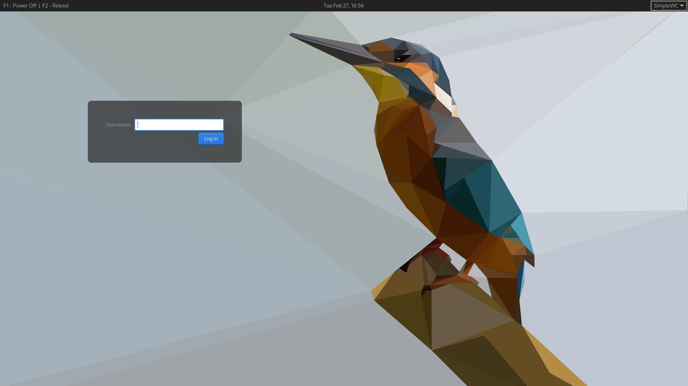

# SimpleGreet
Simple gtk3 greeter for [greetd]. Fork of [gtkgreet] to fit my personal taste.

## Description

[gtkgreet] is a nice graphical front-end to greetd, but I prefer the look closer to lightdm with a top-bar and more versatile clock. There are other minor adjustments that makes it a proper fork, although the core is kept untouched. 

[greetd]: https://git.sr.ht/~kennylevinsen/greetd
[gtkgreet]: https://git.sr.ht/~kennylevinsen/gtkgreet

### Screenshots

v0.1

### Building

    > meson setup build
    > ninja -C build || exit 1
    > sudo ninja -C build install

 - Build dependencies:
   - gtk3
   - gtk-layer-shell (optional but recommended)
 - Run dependency: For obvious reasons you need greetd to run simplegreet.

### Configuration and usage

**Setting up greetd**

Edit /etc/greetd/config.toml (you can use sway or other wayland compositor of choice):

    [terminal]
    vt = 1

    [default_session]
    command = "simplewc --config /etc/greetd/myconfig"
    user = "greeter"

**Setting up the compositor (simplewc in my case)**

In autostart script (or config file of your compositor):

    #!/bin/sh

    simplegreet -l -s /etc/greetd/simplegreet.css 

    simplewc-msg --action quit

the last line is important, as it quits the current instance of the compositor upon successful login.

In the compositor config, you can add keybinds to evoke shutdown or reboot function. e.g.:

    KEY=F1 SPAWN systemctl poweroff -i
    KEY=F2 SPAWN systemctl reboot -i

**Customizing the looks via css**

To use custom css (e.g. /etc/greetd/simplegreet.css):

    window {
       /* use background image */
       background-image: url("file:///etc/greetd/background.png");
    }

    #top_box {
       /* top bar */
    }
    #power_label {
       /* power label, left-justified label of the bar */
    }
    #clock_label {
       /* clock label, center of the bar */
    }
    #command_selector button.combo {
       /* session selector, right-justified selector in the bar */
    }
    #command_selector window menu {
       /* popup window of the selector menu */
    }
    #body_box {
       /* box of the login prompt */
    }
    #input-field {
       /* text input field in the login prompt */
    }

## Version log

 - 0.1 (Work in progress)
   - Goal: Get the base code in working order.
